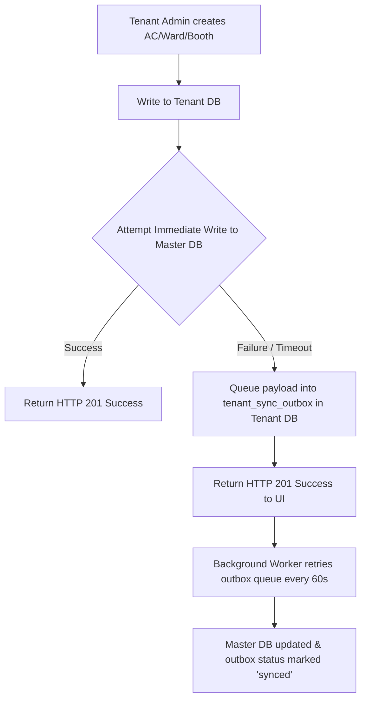
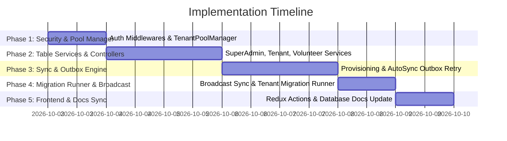

# Complete Architecture & Implementation Plan: Super Admin, Tenant, and Volunteer API Isolation with Resilient Two-Way Synchronization

---

## 1. Executive Summary

This document defines the complete implementation strategy for **Ranniti**'s backend and frontend architecture. It enforces strict role-based 3-tier API isolation (**Super Admin**, **Tenant**, **Volunteer**), modular table-specific services, background tenant database provisioning, two-way auto-update synchronization, and production-grade resilience mechanisms.

---

## 2. Directory & File Structure Blueprint

```
backend/src/
├── middlewares/
│   ├── superAdminAuth.middleware.ts       # Enforces Super Admin role check (role: 'super_admin')
│   ├── tenantAuth.middleware.ts           # Enforces Tenant Admin/User check & attaches cached tenant DB pool
│   └── volunteerAuth.middleware.ts        # Enforces Volunteer check & attaches tenant DB pool + booth scoping
│
├── services/
│   ├── superAdmin/                        # Super Admin Master DB Services (Folder)
│   │   ├── tenant.service.ts              # Tenant profiles & provisioning status
│   │   ├── state.service.ts               # States table CRUD
│   │   ├── district.service.ts            # Districts table CRUD
│   │   ├── pc.service.ts                  # Parliamentary Constituencies table CRUD
│   │   ├── ac.service.ts                  # Assembly Constituencies table CRUD
│   │   ├── ward.service.ts                # Wards table CRUD
│   │   ├── booth.service.ts               # Polling Booths table CRUD
│   │   ├── caste.service.ts               # Castes table CRUD
│   │   ├── religion.service.ts            # Religions table CRUD
│   │   ├── party.service.ts               # Political Parties table CRUD
│   │   └── index.ts                       # Super Admin Services Exporter
│   │
│   ├── tenant/                            # Dedicated Tenant DB Services (Folder)
│   │   ├── ac.service.ts                  # Tenant ACs (+ AutoSync to Master DB)
│   │   ├── ward.service.ts                # Tenant Wards (+ AutoSync to Master DB)
│   │   ├── booth.service.ts               # Tenant Booths (+ AutoSync to Master DB)
│   │   ├── voter.service.ts               # Tenant Voters table CRUD & filtering
│   │   ├── volunteer.service.ts           # Tenant Volunteers & booth allocations
│   │   ├── userRole.service.ts            # Tenant Custom Roles & Field Permissions
│   │   └── index.ts                       # Tenant Services Exporter
│   │
│   ├── volunteer/                         # Volunteer Services (Folder)
│   │   ├── assignedBooth.service.ts       # Volunteer assigned booth lookup
│   │   ├── voterSurvey.service.ts         # Voter status & survey updates
│   │   ├── familyMapping.service.ts       # Family mapping & relationships
│   │   └── index.ts                       # Volunteer Services Exporter
│   │
│   ├── provisioning/
│   │   └── tenantProvisioning.service.ts  # Master -> Tenant DB background creation & initial sync engine
│   ├── sync/
│   │   ├── masterAutoSync.service.ts      # Tenant -> Master DB AutoUpdate engine
│   │   ├── masterBroadcastSync.service.ts # Super Admin updates -> All active Tenant DBs propagator
│   │   └── syncOutboxRetry.service.ts     # Failed sync outbox retry queue worker
│   ├── pool/
│   │   └── tenantPoolManager.ts           # Dynamic Connection Pool Manager (LRU Cache & Auto Cleanup)
│   └── audit/
│       └── auditLogger.service.ts         # Audit Trail & Security Event Logger
│
├── controllers/
│   ├── superAdmin/                        # Super Admin Controllers (Folder)
│   │   ├── tenant.controller.ts           # Tenant creation & status polling
│   │   ├── master.controller.ts           # Master lookup tables management
│   │   └── index.ts
│   ├── tenant/                            # Tenant Controllers (Folder)
│   │   ├── geography.controller.ts        # AC, Ward, Booth endpoints
│   │   ├── voter.controller.ts            # Voter endpoints
│   │   ├── volunteer.controller.ts        # Volunteer endpoints
│   │   └── index.ts
│   └── volunteer/                         # Volunteer Controllers (Folder)
│       ├── survey.controller.ts           # Survey & voter updates
│       └── index.ts
│
└── routes/
    ├── superAdmin.routes.ts               # Mounted at /api/super-admin
    ├── tenant.routes.ts                  # Mounted at /api/tenant
    ├── volunteer.routes.ts               # Mounted at /api/volunteer
    └── index.ts                           # Main API router aggregator
```

---

## 3. Strict 3-Tier API Security Isolation

```mermaid
flowchart TD
    Req[Incoming HTTP Request] --> AuthCheck{Verify JWT Token}
    AuthCheck -- Invalid / Expired --> Err401[401 Unauthorized]
    AuthCheck -- Valid --> RouteCheck{Route Namespace}
    
    RouteCheck -- /api/super-admin/* --> SACheck{Role == super_admin?}
    SACheck -- No --> Err403SA[403 Forbidden: Super Admin Privilege Required]
    SACheck -- Yes --> ExecSA[Execute Master DB Controller]
    
    RouteCheck -- /api/tenant/* --> TenantCheck{Role == tenant_admin | tenant_user | super_admin?}
    TenantCheck -- Volunteer / Invalid --> Err403T[403 Forbidden: Volunteers Cannot Access Tenant API]
    TenantCheck -- Allowed --> ConnectTDB[Attach Cached req.tenantPool & Execute Tenant Controller]
    
    RouteCheck -- /api/volunteer/* --> VolCheck{Role == volunteer | tenant_admin | super_admin?}
    VolCheck -- Unauthorized --> Err403V[403 Forbidden: Access Denied]
    VolCheck -- Allowed --> ConnectVDB[Attach req.tenantPool & Scope to Assigned Booth ID]
```

### Access Boundaries:
- **Tenant access to `/api/super-admin/*`**: Blocked with `HTTP 403 Forbidden`.
- **Volunteer access to `/api/tenant/*`**: Blocked with `HTTP 403 Forbidden`.
- **Volunteer API (`/api/volunteer/*`)**: Scoped strictly to assigned booth voters.

---

## 4. Key Production Resilience Features

### Feature 1: Transactional Outbox & Retry Queue (`syncOutboxRetry.service.ts`)
* **Problem**: If a Tenant Admin creates an AC, Ward, or Booth, but writing to the Master DB temporarily fails due to a network blip or lock, data could get out of sync.
* **Solution**: If Master DB write fails, the item is queued into `tenant_sync_outbox` in the Tenant DB, and a background worker automatically retries every 60 seconds until 100% synced.

```sql
-- Schema for tenant_sync_outbox in Tenant DB
CREATE TABLE IF NOT EXISTS tenant_sync_outbox (
  id UUID PRIMARY KEY DEFAULT gen_random_uuid(),
  entity_type VARCHAR(50) NOT NULL, -- 'ac', 'ward', 'booth'
  entity_id UUID NOT NULL,
  action VARCHAR(20) NOT NULL,       -- 'CREATE', 'UPDATE', 'DELETE'
  payload JSONB NOT NULL,
  status VARCHAR(20) DEFAULT 'pending', -- 'pending', 'failed', 'synced'
  retry_count INT DEFAULT 0,
  error_message TEXT,
  created_at TIMESTAMPTZ DEFAULT CURRENT_TIMESTAMP,
  updated_at TIMESTAMPTZ DEFAULT CURRENT_TIMESTAMP
);
```



---

### Feature 2: Master-to-Tenant Broadcast Sync (`masterBroadcastSync.service.ts`)
* **Problem**: When Super Admin adds a new Caste, Religion, Political Party, or District *after* tenants are already created, existing tenant DBs wouldn't receive the updates.
* **Solution**: Automatically broadcasts master lookup updates to all active Tenant DBs asynchronously.

```typescript
// Broadcast helper execution flow
export class MasterBroadcastSync {
  static async broadcastToAllTenants(tableName: string, recordData: Record<string, any>): Promise<void> {
    const activeTenants = await masterQuery(`SELECT db_name FROM tenant_profiles WHERE provisioning_status = 'ready'`);
    for (const tenant of activeTenants.rows) {
      // Async background dispatch to tenant DB pool
      TenantPoolManager.getPool(tenant.db_name)
        .query(`INSERT INTO ${tableName} ... ON CONFLICT (id) DO UPDATE ...`)
        .catch(err => logger.error(`[BroadcastSync] Failed to sync ${tableName} to ${tenant.db_name}:`, err));
    }
  }
}
```

---

### Feature 3: Tenant Migration Runner (`TenantDbProvisioner.runMigrationsOnAllTenants`)
* **Problem**: Future SQL migrations added to `backend/src/database/migrations/` need to be applied across all existing tenant DBs.
* **Solution**: CLI runner / service command to apply pending migrations to all active tenant databases seamlessly.

```bash
# Executable CLI Runner
npm run migrate:tenants
```

```typescript
export async function runMigrationsOnAllTenants(): Promise<void> {
  const tenants = await masterQuery(`SELECT db_name FROM tenant_profiles WHERE provisioning_status = 'ready'`);
  for (const tenant of tenants.rows) {
    logger.info(`[MigrationRunner] Running pending migrations on '${tenant.db_name}'...`);
    await TenantDbProvisioner.initializeTenantSchema(tenant.db_name);
  }
}
```

---

### Feature 4: Dynamic Connection Pool Manager (`tenantPoolManager.ts`)
* **Problem**: Opening new pool clients per request causes connection overhead; unclosed pools leak connections.
* **Solution**: Caches active tenant pools with an LRU idle cleanup (drains pools inactive for >10 mins) and cleanly closes all pools on server shutdown (`SIGTERM`/`SIGINT`), fulfilling Backend Rule 5.

```typescript
export class TenantPoolManager {
  private static pools: Map<string, { pool: Pool; lastUsed: number }> = new Map();

  static getPool(tenantDbName: string): Pool {
    const existing = this.pools.get(tenantDbName);
    if (existing) {
      existing.lastUsed = Date.now();
      return existing.pool;
    }
    const pool = getTenantDbPool(tenantDbName); // max: 10, idleTimeoutMillis: 10000
    this.pools.set(tenantDbName, { pool, lastUsed: Date.now() });
    return pool;
  }

  static async cleanupIdlePools(maxIdleMs = 600000): Promise<void> {
    const now = Date.now();
    for (const [dbName, item] of this.pools.entries()) {
      if (now - item.lastUsed > maxIdleMs) {
        await item.pool.end();
        this.pools.delete(dbName);
        logger.info(`[PoolManager] Drained idle pool for '${dbName}'`);
      }
    }
  }

  static async closeAll(): Promise<void> {
    for (const [dbName, item] of this.pools.entries()) {
      await item.pool.end();
    }
    this.pools.clear();
  }
}
```

---

### Feature 5: Audit Trail & Security Logging (`audit_logs`)
* **Description**: Logs tenant creation, role updates, manual re-syncs, and auto-update failures for complete security visibility.

```sql
-- Schema for audit_logs in Master DB
CREATE TABLE IF NOT EXISTS audit_logs (
  id UUID PRIMARY KEY DEFAULT gen_random_uuid(),
  user_id UUID,
  tenant_id UUID,
  action VARCHAR(100) NOT NULL,
  entity_type VARCHAR(50),
  entity_id UUID,
  details JSONB,
  ip_address VARCHAR(45),
  user_agent TEXT,
  created_at TIMESTAMPTZ DEFAULT CURRENT_TIMESTAMP
);
```

---

## 5. Implementation Roadmap & Phased Execution



---

> [!NOTE]
> All code edits across both backend and frontend strictly comply with the workspace guidelines in `AGENTS.md`.

---

## 6. Website & UI Creation Blueprint (`web/`)

### 🎨 6.1 Design Aesthetics & Component Guidelines
- **Color Palette & Glassmorphism**: Indigo/Violet theme for Super Admin (`/dashboard/master/*`, `/dashboard/tenants/*`) and Emerald/Teal theme for Tenant Campaign Managers (`/dashboard/voters/*`, `/dashboard/geography/*`).
- **Typography & Motion**: Modern sans-serif typography (`Inter` / `Outfit`) with subtle hover animations, loading skeletons, and interactive states.
- **Strict Compliance with `AGENTS.md` Rules**:
  - **No Fallback Mock Data (Rule 8)**: Show loading shimmers or clean empty states, never initial dummy arrays.
  - **Redux Actions Only (Rule 9)**: Components dispatch Redux thunk actions (`dispatch(fetchMasterCategoryData())`) and consume state via `useAppSelector`.
  - **Reusable Modal (`src/components/common/Modal.tsx`, Rule 10)**: Shared dialog overlay for all forms.
  - **Single Key Access (Rule 11)**: Strict camelCase property access (`row.pcName`, `row.acName`).
  - **Safe Image (`src/components/common/SafeImage.tsx`, Rule 12)**: Standard component with initials fallback and loading skeleton.
  - **Debounced Effect (`src/hooks/useDebouncedEffect.ts`, Rule 13)**: All search and fetch side-effects debounced (150-250ms).
  - **Form Input (`src/components/common/FormInput.tsx`, Rule 14)**: Unified input/select component with right chevron arrows.
  - **Dropdown Constants (`src/constants/dropdownOptions.ts`, Rule 15)**: Centralized options (`GENDER_OPTIONS`, `VOTER_TYPE_OPTIONS`, `STATUS_OPTIONS`).
  - **File Upload (`src/components/common/FileUploadInput.tsx`, Rule 16)**: Interactive file picker with 5MB limit and image preview.
  - **Page Header (`src/components/common/PageHeader.tsx`, Rule 18)**: Standardized header title banner and top action buttons.
  - **Table Actions (`src/components/common/TableActions.tsx`, Rule 19)**: Uniform view/edit/delete icon action cells.

---

### 🖥️ 6.2 Page Structure & Navigation Routing

```
web/src/
├── pages/
│   ├── login/
│   │   └── index.tsx                             # Unified Login Page (Super Admin, Tenant Admin, Volunteer)
│   │
│   ├── super_admin/                              # Super Admin Web Module
│   │   ├── tenants/
│   │   │   ├── TenantsPage.tsx                   # Tenant profiles table & status badges
│   │   │   ├── TenantFormPage.tsx                # Provision new tenant (AC selection & Db allocation)
│   │   │   └── TenantDetailPage.tsx              # Provisioning progress live tracker (0% -> 100%)
│   │   ├── roles/
│   │   │   └── TenantRoleManager.tsx             # Tenant Feature Package Roles (Tier 1)
│   │   └── master/
│   │       ├── MasterCategoryView.tsx            # Central Master Data Manager Tabs
│   │       ├── CastesPage.tsx                    # Castes CRUD (+ AutoBroadcast)
│   │       ├── ReligionsPage.tsx                 # Religions CRUD (+ AutoBroadcast)
│   │       ├── PartiesPage.tsx                   # Political Parties (+ Symbol Logo Upload)
│   │       ├── StatesPage.tsx                    # States CRUD
│   │       ├── DistrictsPage.tsx                 # Districts CRUD
      │   │       ├── PcsPage.tsx                       # Parliamentary Constituencies CRUD
│   │       ├── AcsPage.tsx                       # Assembly Constituencies CRUD
│   │       ├── WardsPage.tsx                     # Wards CRUD
│   │       └── BoothsPage.tsx                    # Polling Booths CRUD
│   │
│   ├── tenant/                                   # Tenant Campaign Web Module
│   │   ├── geography/
│   │   │   ├── TenantAcsPage.tsx                 # Tenant ACs (+ AutoSync badge)
│   │   │   ├── TenantWardsPage.tsx               # Tenant Wards (+ AutoSync badge)
│   │   │   └── TenantBoothsPage.tsx              # Tenant Booths (+ AutoSync badge)
│   │   ├── voters/
│   │   │   ├── VotersPage.tsx                    # Advanced Voter Directory & Filter Bar
│   │   │   ├── VoterDetailPage.tsx               # Voter detail, family tree drawer, & KYC
│   │   │   └── VoterFormPage.tsx                 # Voter add/edit form
│   │   ├── roles/
│   │   │   └── TenantUserRoleManager.tsx         # Tenant User Roles & Field Permissions (Tier 2)
│   │   └── settings/
│   │       └── SettingsPage.tsx                  # Campaign settings & FCM/WhatsApp API config
│   │
│   └── volunteer/                                # Mobile Field Survey Web View
│       ├── AssignedBoothsPage.tsx                # Assigned booth list
│       └── BoothSurveyPage.tsx                   # Touch-friendly voter survey sheet
```

---

### 🔄 6.3 Redux State Slice & Action Architecture

```
web/src/redux/
├── actions/
│   ├── auth.ts                                   # Login, Logout, User Session
│   ├── superAdmin.ts                             # Super Admin API thunks (/api/super-admin/*)
│   ├── tenant.ts                                 # Tenant API thunks (/api/tenant/*)
│   ├── volunteer.ts                              # Volunteer API thunks (/api/volunteer/*)
│   ├── voter.ts                                  # Voter CRUD & Filter thunks
│   ├── master.ts                                 # Master lookup table thunks
│   └── role.ts                                   # Role management thunks
│
├── reducers/
│   ├── auth.ts                                   # User payload & tenantDbName state
│   ├── superAdmin.ts                             # Master tables & tenant profiles state
│   ├── tenant.ts                                 # Tenant geography & outbox sync state
│   ├── volunteer.ts                              # Assigned booths & survey state
│   ├── voter.ts                                  # Voter list, pagination, & selection state
│   └── master.ts                                 # Global master lookup cache
```

