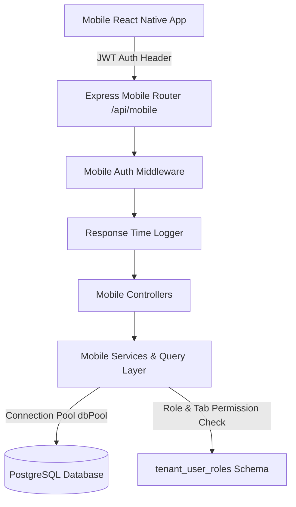
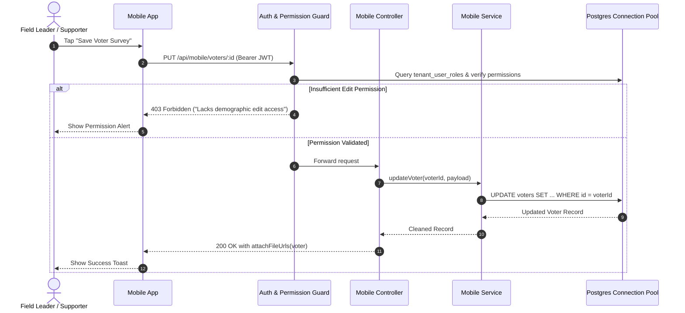
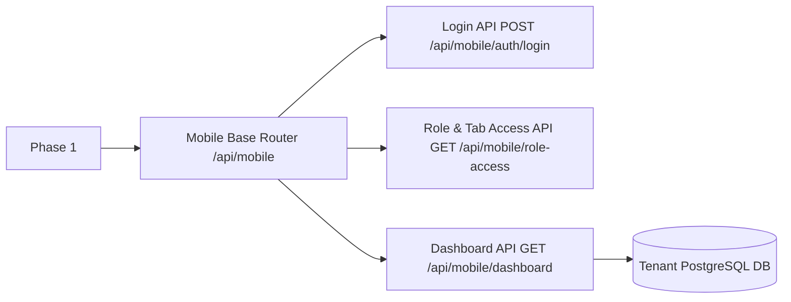

# 📱 Mobile Application API Implementation Plan

## 1. Executive Summary & Architecture Blueprint

This document outlines the end-to-end architectural plan to implement the complete suite of Mobile Application APIs for field leaders, AC leaders, sub-leaders, and booth supporters in the **Ranniti** platform. 

The mobile API layer will provide secure, highly performant, role-permissioned REST endpoints enforcing strict tenant isolation, granular field editing controls, and seamless phone contact synchronization.



---

## 2. Granular Role & Tab Access Matrix

Field users are categorized into hierarchical roles with customizable tab visibility and voter data edit permissions defined in `tenant_user_roles`:

| Role Key | Role Title | Mobile Tab Access | Subordinate Role Onboarding (`can_create_roles`) | Voter Data Edit Rights (`voter_permissions`) |
| :--- | :--- | :--- | :--- | :--- |
| `ac_leader` | Assembly Constituency Leader | `Dashboard`, `Voters`, `Team`, `Surveys`, `Profile` | `['sub_leader', 'supporter']` | Full edit (`can_edit_contact`, `can_edit_demographics`, `can_edit_inclination`, `can_edit_voter_status`, `can_manage_family`) |
| `sub_leader` | Sector / Area Sub-Leader | `Dashboard`, `Voters`, `Team`, `Surveys`, `Profile` | `['supporter']` | Standard edit (`can_edit_contact`, `can_edit_demographics`, `can_edit_inclination`, `can_edit_voter_status`) |
| `supporter` | Booth Level Supporter | `Dashboard`, `Voters`, `Surveys`, `Profile` | `[]` (None) | Restricted edit (`can_edit_contact`, `can_edit_inclination`) |

---

## 3. Detailed API Specifications

### 3.1 Mobile Login API
- **Endpoint**: `POST /api/mobile/auth/login`
- **Auth Required**: No (Public)
- **Description**: Authenticates field volunteers via email or mobile number and returns a JWT along with pre-calculated role capabilities and profile URLs.

#### Request Body
```json
{
  "emailOrMobile": "9876543210",
  "password": "Password123!"
}
```

#### Response Body (`200 OK`)
```json
{
  "success": true,
  "statusCode": 200,
  "message": "Mobile authentication successful",
  "data": {
    "token": "eyJhbGciOiJIUzI1NiIsInR5cCI6IkpXVCJ9...",
    "user": {
      "id": "a0eebc99-9c0b-4ef8-bb6d-6bb9bd380a11",
      "name": "Rajesh Sharma",
      "email": "rajesh@ranniti.in",
      "mobile": "9876543210",
      "role": "ac_leader",
      "roleName": "Assembly Constituency Leader",
      "avatar": "http://localhost:5000/uploads/avatars/rajesh.jpg",
      "assignedAcId": "c39e269b-6761-4172-a720-6d35368a411e",
      "assignedBoothIds": ["110e8400-e29b-41d4-a716-446655440000"]
    },
    "access": {
      "mobileScreens": ["Dashboard", "Voters", "Team", "Surveys", "Profile"],
      "voterPermissions": {
        "canViewVoter": true,
        "canEditContact": true,
        "canEditDemographics": true,
        "canEditInclination": true,
        "canEditVoterStatus": true,
        "canManageFamily": true,
        "canExportData": false
      },
      "canCreateRoles": ["sub_leader", "supporter"]
    }
  }
}
```

---

### 3.2 Mobile Dashboard API
- **Endpoint**: `GET /api/mobile/dashboard`
- **Auth Required**: Yes (`Bearer <token>`)
- **Description**: Delivers real-time field performance metrics, team hierarchy breakdown, gender/age demographics, and turnout stats matching the mobile React Native screen requirements (`app/src/screens/Dashboard/`). *(Note: `politicalViews` is omitted for now per user requirements).*

#### Response Body (`200 OK`)
```json
{
  "success": true,
  "statusCode": 200,
  "message": "Dashboard statistics fetched successfully",
  "data": {
    "assignedBoothsCount": 42,
    "totalVotersCount": 48500,
    "hierarchy": {
      "acLeadersCount": 8,
      "subLeadersCount": 36,
      "supportersCount": 142
    },
    "influencers": {
      "familyInfluencersCount": 380,
      "socialInfluencersCount": 124,
      "totalInfluencersCount": 504
    },
    "syncedContactsVotersCount": 412,
    "genderData": {
      "male": 25400,
      "female": 22800,
      "other": 300
    },
    "ageData": {
      "youth": 16200,
      "adult": 21500,
      "senior": 10800
    },
    "turnoutData": {
      "votedCount": 31200,
      "totalVoters": 48500
    }
  }
}
```

---

### 3.3 Get Role and Tab Access API
- **Endpoint**: `GET /api/mobile/role-access`
- **Auth Required**: Yes (`Bearer <token>`)
- **Description**: Dynamically fetches the logged-in user's role configuration, feature flags, mobile screen navigation layout, and permissions.

#### Response Body (`200 OK`)
```json
{
  "success": true,
  "statusCode": 200,
  "message": "Role and tab access configuration retrieved",
  "data": {
    "roleKey": "ac_leader",
    "roleName": "Assembly Constituency Leader",
    "mobileScreens": ["Dashboard", "Voters", "Team", "Surveys", "Profile"],
    "voterPermissions": {
      "canViewVoter": true,
      "canEditContact": true,
      "canEditDemographics": true,
      "canEditInclination": true,
      "canEditVoterStatus": true,
      "canManageFamily": true,
      "canExportData": false
    },
    "canCreateRoles": ["sub_leader", "supporter"]
  }
}
```

---

### 3.4 Get & Update Volunteer Profile API
- **Endpoint**: `GET /api/mobile/profile` | `PUT /api/mobile/profile`
- **Auth Required**: Yes (`Bearer <token>`)
- **Description**: Reads or updates field profile metadata (Name, mobile, avatar image).

#### Update Request Body (`PUT /api/mobile/profile`)
```json
{
  "name": "Rajesh Sharma",
  "mobile": "9876543210",
  "avatar": "/uploads/avatars/rajesh_updated.jpg"
}
```

---

### 3.5 Get Assigned Voter List & Granular Voter Edit API
- **Endpoint**: `GET /api/mobile/voters`
- **Auth Required**: Yes (`Bearer <token>`)
- **Description**: Returns voters scoped to the logged-in volunteer's assigned booth IDs or AC ID with pagination and multi-filter support.

#### Query Parameters:
- `page`: default `1`
- `limit`: default `25`
- `search`: string (Fuzzy match on EPIC, English/Local name, Mobile)
- `boothId`: UUID
- `inclination`: string (`favorable`, `unfavorable`, `neutral`, `doubtful`)
- `gender`: string (`Male`, `Female`, `Other`)

#### Update Voter Endpoint (`PUT /api/mobile/voters/:id`)
- **Description**: Updates voter record fields. The backend validates requested fields against the user's `voter_permissions` stored in `tenant_user_roles`.

```json
{
  "mobileNo": "9123456780",
  "email": "sanjay.patel@gmail.com",
  "casteId": "e4f5a6b7-1111-2222-3333-444455556666",
  "voterType": "Favorable",
  "isDead": false
}
```

*Field-Level Permission Guard*:
- If user modifies `mobileNo` -> Requires `can_edit_contact: true`
- If user modifies `casteId` -> Requires `can_edit_demographics: true`
- If user modifies `voterType` -> Requires `can_edit_inclination: true`
- If user modifies `isDead` -> Requires `can_edit_voter_status: true`

---

### 3.6 Sync Voter List to Phone Contact List API
- **Endpoint**: `POST /api/mobile/voters/sync-contacts`
- **Auth Required**: Yes (`Bearer <token>`)
- **Description**: Syncs assigned voter records with device phone contacts by checking phone numbers/emails or fetching formatted contact cards.

#### Request Body
```json
{
  "phoneNumbers": ["9876543210", "9123456780", "9988776655"],
  "emails": ["sanjay.patel@gmail.com"]
}
```

#### Response Body (`200 OK`)
```json
{
  "success": true,
  "statusCode": 200,
  "message": "Contact list synchronized successfully",
  "data": {
    "totalMatched": 2,
    "matchedVoters": [
      {
        "voterId": "d1e2f3a4-5555-4444-8888-999900001111",
        "epicNo": "ABC1234567",
        "name": "Sanjay Patel",
        "mobileNo": "9123456780",
        "boothNo": "Booth #42",
        "village": "Shivajinagar"
      }
    ]
  }
}
```

---

### 3.7 Onboard Team Members API (Create AC Leader, Sub-Leader, Supporter)
- **Endpoint**: `POST /api/mobile/team`
- **Auth Required**: Yes (`Bearer <token>`)
- **Description**: Onboards subordinate team members. Validates that `role` belongs to `can_create_roles` in user's role access definition and automatically binds `parent_leader_id = req.user.userId`.

#### Request Body
```json
{
  "name": "Amit Kumar",
  "email": "amit.supporter@ranniti.in",
  "mobile": "9811223344",
  "password": "SecurePassword123!",
  "role": "supporter",
  "assignedBoothIds": ["110e8400-e29b-41d4-a716-446655440000"]
}
```

---

### 3.8 See List of Team Members API (Hierarchy Directory)
- **Endpoint**: `GET /api/mobile/team`
- **Auth Required**: Yes (`Bearer <token>`)
- **Description**: Fetches direct and indirect downstream team members under the logged-in user with survey stats per volunteer.

#### Query Parameters:
- `role`: optional filter (`sub_leader`, `supporter`)
- `search`: string (Name/Mobile match)

---

## 4. End-to-End Sequence Diagram



---

## 5. Phased Implementation Roadmap

### 🚀 Phase 1: Authentication, Role Access & Dashboard API (Immediate Target)



#### Phase 1 Deliverables & Files:

| File Path | Action | Description |
| :--- | :--- | :--- |
| `backend/src/routes/mobile/index.ts` | **Create** | Central router for `/api/mobile/*` |
| `backend/src/routes/mobile/mobileAuth.routes.ts` | **Create / Update** | Mounting `/login` & `/role-access` |
| `backend/src/routes/mobile/mobileDashboard.routes.ts` | **Create** | Mounting `/dashboard` with `authenticateJwt` middleware |
| `backend/src/controllers/mobile/mobileDashboard.controller.ts` | **Create** | Calculates assigned booths, total voters, hierarchy breakdown, influencers, gender/age demographics, turnout |
| `backend/src/services/mobile/mobileDashboard.service.ts` | **Create** | Fast SQL queries executed against tenant connection pool (`dbPool`) |
| `backend/src/services/mobileAuth.service.ts` | **Update** | Enriches JWT login payload with role permissions, screen lists, and file URLs |

---

### 📦 Phase 2: Volunteer Profile & Assigned Voters List with Granular Edits
- **Files**: `mobileProfile.routes.ts`, `mobileVoter.routes.ts`, `mobileVoter.controller.ts`, `mobileVoter.service.ts`
- **Scope**:
  - `GET /api/mobile/profile` & `PUT /api/mobile/profile`
  - `GET /api/mobile/voters` (Assigned booth filter, fuzzy search, pagination)
  - `PUT /api/mobile/voters/:id` (Field permission guards: `can_edit_contact`, `can_edit_demographics`, `can_edit_voter_status`)

---

### 📲 Phase 3: Phone Contact List Sync API
- **Files**: `mobileContactSync.controller.ts`, `mobileContactSync.service.ts`
- **Scope**:
  - `POST /api/mobile/voters/sync-contacts` (Matches device contacts by phone numbers & emails against tenant voters table)

---

### 👥 Phase 4: Team Onboarding & Hierarchy Directory API
- **Files**: `mobileTeam.routes.ts`, `mobileTeam.controller.ts`, `mobileTeam.service.ts`
- **Scope**:
  - `POST /api/mobile/team` (Onboards Sub-Leaders/Supporters with `can_create_roles` authorization)
  - `GET /api/mobile/team` (Lists downstream team members with survey activity stats)

---

## 6. Architectural Rules Compliance Checklist

- [x] **Rule #1 (File Base URLs)**: All profile avatar and voter image URLs wrapped in `attachFileUrls(payload, keys, req)`.
- [x] **Rule #3 (Response Time Logging)**: All `/api/mobile/*` endpoints monitored with `responseTimeMiddleware`.
- [x] **Rule #5 (Connection Safety)**: DB queries run through `dbPool` or client release in `try...finally`.
- [x] **Rule #6 (Database Schema Syncing)**: Table specs under `backend/docs/database/tables/` remain 100% updated.
- [x] **Rule #7 (Migration File Naming)**: Any migration files created use `snake_case.sql` without numeric/timestamp prefixes.
