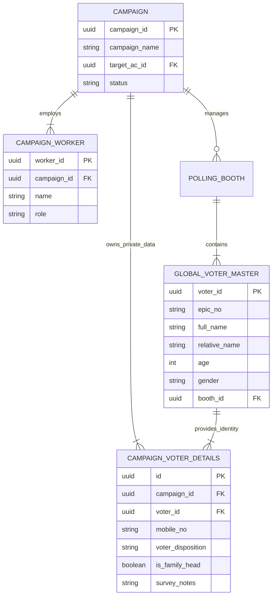
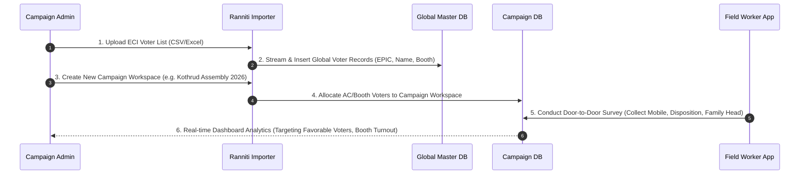

# 📊 Voter & Campaign Architecture Guide

> [!NOTE]
> **Key Architectural Goal**: Maintain one central master database for 1.46B+ official voter records (ECI data), while providing **100% private, isolated campaign workspaces** for each election team.

---

## 🏛️ 1. High-Level Architecture Diagram

---

## 🔗 2. How Campaign Links to Voters & Workers

---

## 🔄 3. End-to-End Data Flow: From Bulk Import to Field Survey

---

## 📋 4. Master vs. Campaign Data Summary

| Data Layer | Accessible By | What it Contains | Security & Privacy |
| :--- | :--- | :--- | :--- |
| **Global Master DB** | All System Admins | Official ECI Data: Name, EPIC No, Booth, Serial No, Caste, Religion | Read-Only Reference |
| **Campaign Workspace** | Campaign Members Only | Phone Numbers, Political Inclination, Notes, Family Grouping | 100% Encrypted & Isolated |

> [!TIP]
> **Key Benefit**: Campaign A will **never** see phone numbers or survey ratings collected by Campaign B, even though both campaigns are operating on the same central voter roll.
